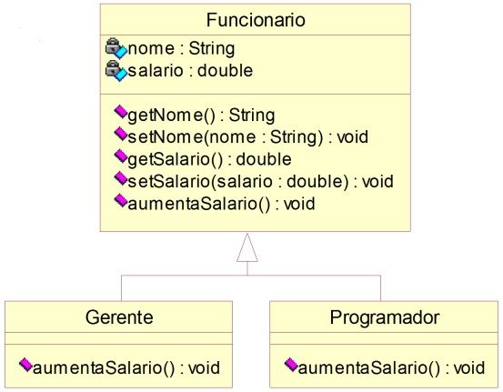
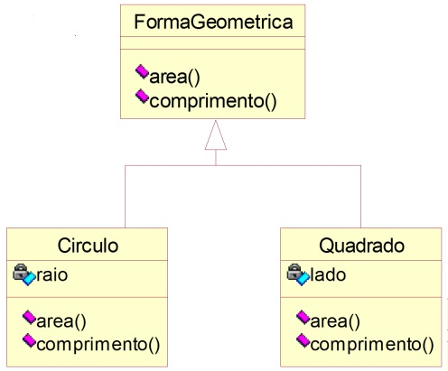
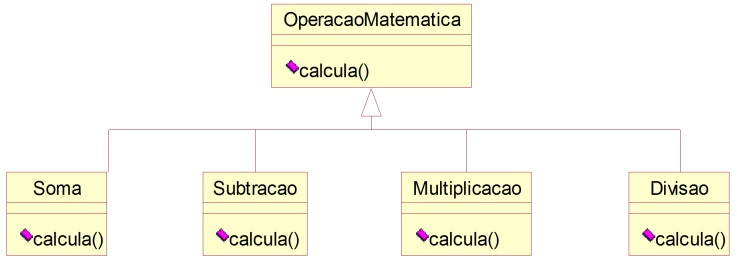

# Classe Abstrata

### **Exercício 1**

- A classe *Funcionario* é abstrata.
- O método **aumentaSalario( )** da classe *Funcionário* é abstrato.
- As classes *Gerente* e *Programador* são concretas.
- Uma chamada ao **aumentaSalario( )** do Gerente aumenta seu salário em 10%.
- Uma chamada ao **aumentaSalario( )** do Programador aumenta seu salário em 20%.

**Aplicação**

- Implemente uma aplicação que declara duas variáveis do tipo Funcionario e cria dois objetos um do tipo Gerente e outro do tipo Programador. Em seguida, o programa deve oferecer um menu para o usuário com as seguintes opções:
    - Imprimir dados – O usuário deverá informar se ele deseja imprimir os dados do Gerente ou do Programador.
    - Aumentar salário – O usuário deverá informar se ele deseja aumentar o salário do Gerente ou do Programador.

### **Exercício 2**

- Suponha que queiramos criar diversas classes de caráter geométrico, tais como *Triangulo*, *Quadrado*, *Circulo*, etc. Observe que todas elas deverão ter métodos de cálculo de suas respectivas áreas e perímetros.
- Neste caso podemos criar uma classe denominada *FormaGeometrica*, da qual todas as outras herdariam e, dentro desta classe, especificamos os métodos que as subclasses possuem em comum (**área** e **perímetro**).

### **Exercício 3**

Transformar a classe *InfoCliente* do exercício de *Clientes* da aula de [herança](https://github.com/luizgnclvs/poo-unicap/tree/main/Heran%C3%A7a) em uma classe abstrata.

### **Exercício 4**

Implementar, usando classe abstrata, o seguinte modelo de classes.

