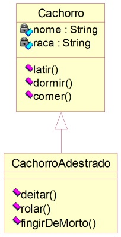

# Herança

### **Exemplo** - Acrescentando características

Como construir um objeto de uma classe que herda de outra?

- Encadeamento de construtores
    - Primeiramente, no construtor da subclasse deve-se fazer uma chamada ao construtor da superclasse.
    - Em seguida, faz-se a inicialização dos atributos da própria subclasse.
    - Uso da palavra reservada **super**.
        - Referenciar explicitamente definições (construtores, métodos, atributos) que foram implementadas na superclasse.

Código Fonte

    public Cliente(String nome, String endereco) {
        this.setNome(nome);
        this.setEndereco(endereco);
    }

    public ClientePessoaFisica(String n, String end, String cpf) { 
        super(n, end);
        this.setCpf(cpf);
    }

- Qualquer elemento, tal como um atributo, variável ou parâmetro de método, que pode referenciar valores de tipos diferentes durante o curso de execução de um programa pode ser considerado como polimórfico.
- Os tipos diferentes que podem ser referenciados por um elemento polimórfico são, exatamente, o supertipo e todos os seus subtipos.

Código Fonte

    public class AplicacaoCliente {
        public static void main(String[ ] args) {
            Cliente cli = new ClientePessoaFisica(“Fulano”, “Rua tal”, “123”);
            AplicacaoCliente.imprime(cli);
        }

        public static void imprime(Cliente c) {
            System.out.println(“Nome: ” + c.getNome( ));
            System.out.println(“Endereço: ” + c.getEndereco( ));
            System.out.println(“CPF: ” + c.getCpf( ));
        }
    }

- Problema da Perda de Informação
    - O que acontece é que o compilador toma as suas decisões com base apenas no tipo declarado para a variável.
    - Contudo, Java dispõe de mecanismos que permitem contornar este problema:
        - Conversão de tipos: **cast**
        - O operador **instanceof**
            - Permite determinar qual o tipo de um objeto que está sendo referenciado por uma variável.

Código Fonte

    public class AplicacaoCliente {
        public static void main(String[ ] args) {
            Cliente cli = new ClientePessoaFisica(“Fulano”, “Rua tal”, “123”);
            AplicacaoCliente.imprime(cli);
        }

        public static void imprime (Cliente c) {
            System.out.println(“Nome: ” + c.getNome( ));
            System.out.println(“Endereço: ” + c.getEndereco( ));

            if (c instanceof ClientePessoaFisica) {
                System.out.println(“CPF: ” + ((ClientePessoaFisica)c).getCpf( ));
            } else if (c instanceof ClientePessoaJuridica) {
                System.out.println(“CNPJ: ” + ((ClientePessoaJuridica)c).getCnpj( ));
            }
        }
    }

### **Exercício**

Implementar as classes do seguinte modelo:

- Atributos:
    - *String* -> não podem receber valores nulos ou *String* vazia.
- Métodos de acesso aos atributos (**get**/**set**);
- Um construtor que receba valores para todos os atributos das classes.
- **OBS:** Usar a técnica de encapsulamento sugerida no curso.
- Implemente um programa chamado *Aplicacao* que cria dois objetos: um do tipo *Cachorro* e outro do tipo *CachorroAdestrado*. Ao final, o programa deve imprimir na tela os dados dos objetos criados fazendo chamadas ao método estático **imprime** implementado na classe *Aplicacao*:
    - **public static void imprime (Cachorro c)**