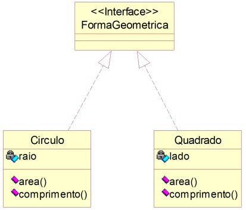
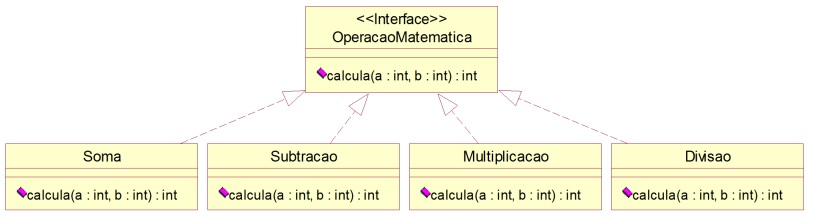

# Interfaces

### **Exercício 1**

Forma Geométrica

Interface Forma Geométrica

    interface FormaGeometrica {
        public double area();

        public double perimetro();
    }

Classe Círculo

    public class Circulo implements FormaGeometrica {
        private double raio;
        private static final double PI = 3.14;

        // Implementar construtor e métodos get e set

        public double area( ) {
            return (PI * raio * raio);
        }

        public double comprimento( ) {
            return (2 * PI * raio);
        }
    }

- Construir a classe *Quadrado* que implementa a interface *FormaGeometrica*;
- Implementar programa de testes que declara duas variáveis do tipo *FormaGeometrica* e instancia dois objetos um do tipo *Circulo* e outro do tipo *Quadrado*. Exibir a **área** e o **comprimento** dos objetos instanciados.

### **Exercício 2**

- Implementar uma aplicação que declara uma variável polimórfica do tipo *OperacaoMatematica*.
- A partir de dados fornecidos pelo usuário, a aplicação deve realizar uma operação matemática e imprimir o seu resultado.
- Oferecer para o usuário um menu para a escolha entre as operações matemáticas disponíveis.
- **OBS 1:** Não defina *a* e *b* como atributos.
- **OBS 2:** Implemente um construtor padrão para cada uma das classes