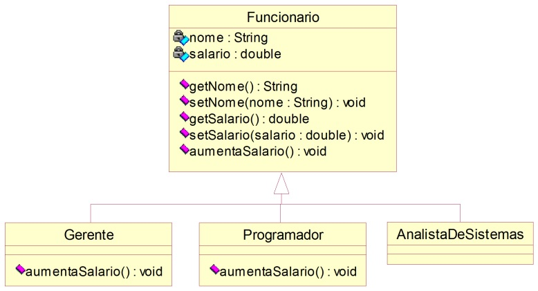
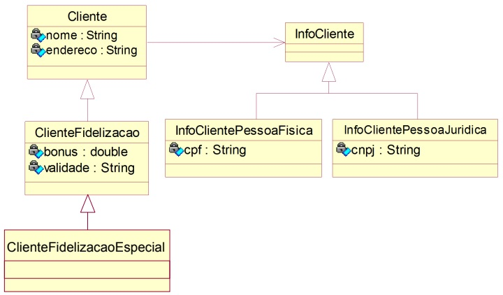

# Sobreposição

### **Exercício 1**

**Considerações:**

- A classe *Funcionario* é abstrata.
- As classes *Gerente* e *Programador* são concretas.
- Uma chamada ao **aumentaSalario( )** do *Funcionario* aumenta seu salário em 5%.
- Uma chamada ao **aumentaSalario( )** do *Gerente* aumenta seu salário em 10%.
- Uma chamada ao **aumentaSalario( )** do *Programador* aumenta seu salário em 20%.

**Aplicação:**

Implemente uma aplicação que declara três variáveis do tipo *Funcionario* e cria três objetos um do tipo *Gerente*, outro do tipo *Programador* e o terceiro do tipo *AnalistaDeSistemas*. Em seguida, o programa deve oferecer um menu para o usuário com as seguintes opções:

- **Imprimir dados** – O usuário deverá informar se ele deseja imprimir os dados do *Gerente*, do *Programador* ou do *AnalistaDeSistemas*.

- **Aumentar salário** – O usuário deverá informar se ele deseja aumentar o salário do *Gerente*, do *Programador* ou do *AnalistaDeSistemas*.

### **Exercício 2**

1. Acrescentar a classe *ClienteFidelizacao* o método **adicionaBonus** que recebe o valor da compra realizada pelo cliente e soma ao *bônus* do cliente 5% do valor desta compra.

2. Suponha que agora, no sistema, existe mais um tipo de *Cliente*, o *ClienteFidelizacaoEspecial*, que apresenta as mesmas características do *ClienteFidelizacao* porém, ganha *bônus* de 10% em cima das compras realizadas.

### **Exercício 3**

1. Implemente uma classe *Conta* que contenha os atributos *nome do cliente*, *número da conta*, *saldo* e *limite*. Estes valores deverão ser informados no construtor, sendo que o limite não poderá ser maior que o valor do *salário mensal do cliente*. Implemente também um método **depósito** e outro método **saque**. O método **saque** retorna um booleano indicando se o saque pôde ser efetuado ou não.

2. Implemente uma classe *ContaEspecial* que funciona da mesma forma que a classe *Conta*, mas que aceita um *limite* de até 3 vezes o valor do *salário do cliente*.